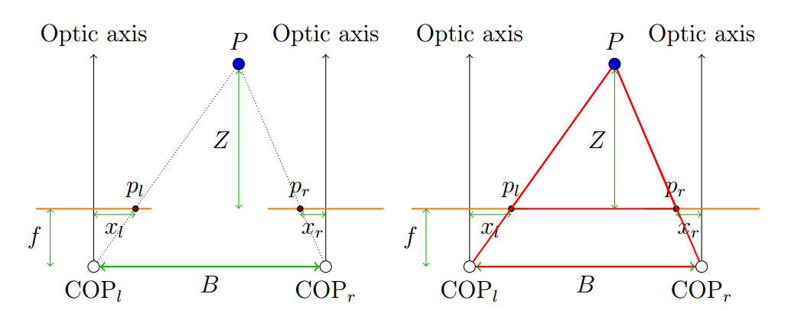

# Basic Stereo Geometry

The simple stereo camera system is shown below.  The cameras are separated by a baseline, $$B$$, and their **focal length** is $$f$$.  We have some point $$P$$ at a distance $$Z$$ in the camera coordinate system.  We can also measure the distances $$x_l$$, $$x_r$$, which are the points of intersection with the left and right planes. 

Note that $$x_l \geq 0$$, $$x_r \leq 0$$

With similar triangles, we have the relationship:
$$
\frac{B - x_l + x_r}{z -f} = \frac{B}{Z}
$$
Rearranging gives us:
$$
Z = f\frac{B}{x_l - x_r}
$$
We are computing the distance to something in the scene based on **disparity**.  In other words, disparity is inversely proportional to depth.

## Finding Disparity

Given a point in an image,we know that a similar point in the other image has to be somewhere within some constraints.  We can use **Squared Eucliean distance** to find the pixel in one image that was most similar to the pixel in another using a "feature patch":
$$
d^2_E = \sum_{x=0}^W \sum_{y=0}^H(A(x, y) - B(x, y))^2
$$
A smaller distance meant a more similar feature patch.  