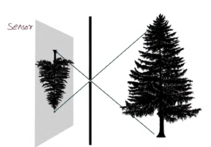

# Camera

## How Camera works

Imagine a "sensor" as just being a large surface that captures all of an object's reflected light.  We add a layer between the sensor and the object that has a small hole in the middle to only allow light rays that head in a very specific direction to hit the "sensor".  This hole is know as **pinhole** or "**aperture**".

