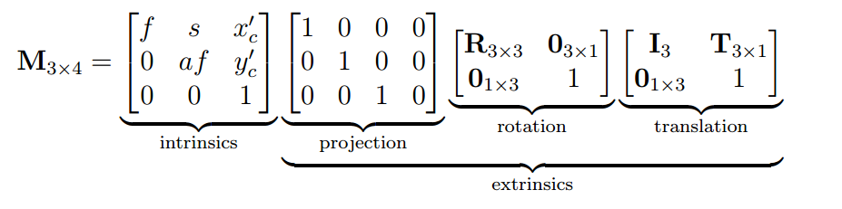

# Combining Extrinsic and Intrinsic Calibration Parameters

$$
\overrightarrow{p'}= K_{[3 \times 3]} \space (^C_W R \space \space \space ^C_W\overrightarrow{t})_{[3 \times 4]}  \space ^W\overrightarrow{p}_{[4 \times 1]}
$$

$$
\overrightarrow{p'}= M \quad ^W\overrightarrow{p}
$$

## Full camera calibration equation

### DOF

5 + 0 + 3 + 3 = **11**

