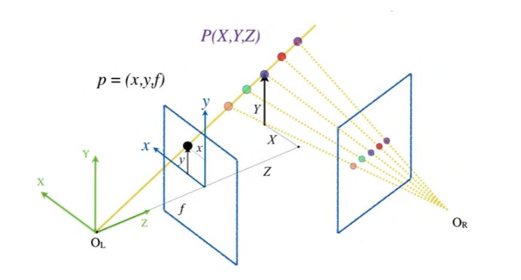
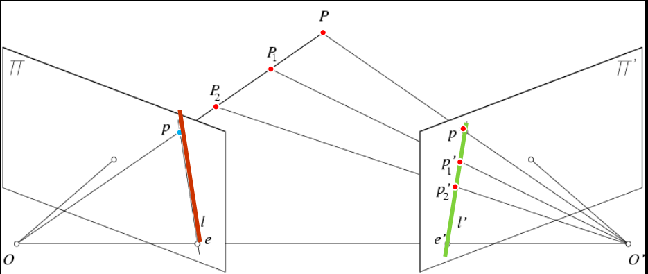

# Epipolar Geometry

Consider the general case in which we do not have parallel optical axes.  Given a point $$p$$ in the left image, where can the corresponding point $$p'$$ be in the right image?

## Stereo correspondence constraints

In perspective projection, lines project into lines.

So the line containing the center of projection and the point $$p$$ in the left image must project to a **line** in the right image.

## Epipolar Constraint

Geometry of two views constraints where the corresponding pixel for some image point in the first view must occur in the second view.

## Epipolar geometry: Terms

- Baseline: lien joining the camera centers
- Epiploar plane: plane containing baseline and world point
- Epipolar line: intersection of epipolar plane with the image plane - come in pairs
- Epipole: point of intersection of baseline with image plane.

**The epipolar constraint reduces the "correspoindence problem" into a 1D search across an epipolar line**