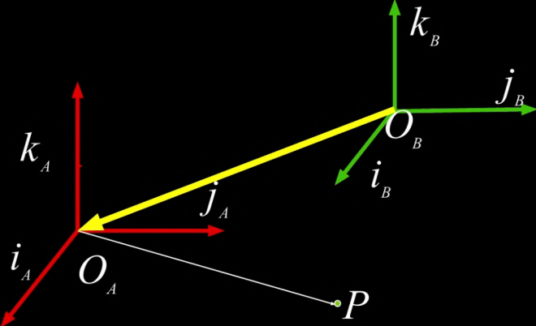
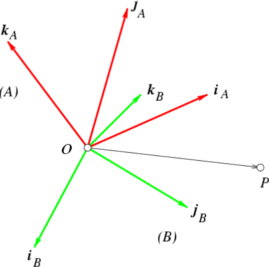
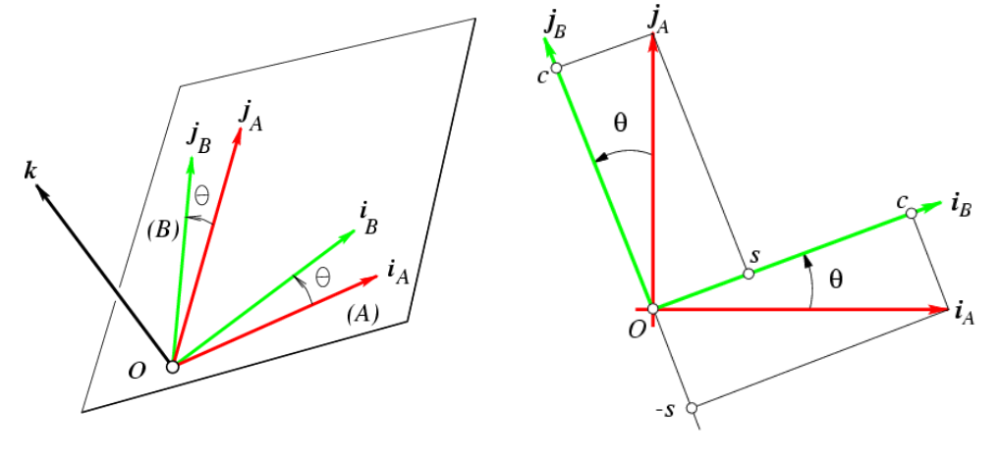

# Extrinsic Parameters

## Transformation

Transformation from "world space" to "camera space": 6 degree of freedom.

## Notation

**$$^AP$$** is the coordinates of $$P$$ in frame $$A$$.

Given some origin $$^A O$$, 
$$
^A P = \begin{bmatrix}
^Ax \\
^Ay \\
^Az
\end{bmatrix}

\Leftrightarrow 	
\overrightarrow{OP} = (^Ax \cdot i_A)(^Ay \cdot j_A)(^Az \cdot k_A)
$$

## Translation 

$$
^BP = ^AP + ^B(O_A)
$$
Using homogeneous coordinates, translation can be expressed as a matrix multiplication.
$$
\begin{bmatrix} ^Bp \\ 1
\end{bmatrix}
= 
\begin{bmatrix} I & ^BO_A 
\\ 0^T & 1
\end{bmatrix}
\begin{bmatrix} 
^AP \\
1
\end{bmatrix}
$$
Where $$I$$ is 3x3 identity.

**Translation is commutative.**

## Rotation

$$
^PB = (^B_AR) (^AP)
$$
$$^B_AR$$ is the rotation matrix, which means describing frame A in the coordinates system of frame B
$$
^B_AR = 
\begin{bmatrix} 
i_A \cdot i_B & j_A \cdot i_B & k_A \cdot i_B \\
i_A \cdot j_B & j_A \cdot j_B & k_A \cdot j_B \\
i_A \cdot k_B & j_A \cdot k_B & k_A \cdot k_B \\
\end{bmatrix} \\

= \begin{bmatrix} 
^Bi_A & ^Bj_A & ^Bk_A
\end{bmatrix} \\
=  \begin{bmatrix} 
{^Ai_B}^T \\
{^Aj_B}^T \\
{^Ak_B}^T
\end{bmatrix} \\
$$

### Example: Rotation about z axis

$$
R_z(\theta) = 
\begin{bmatrix} 
\cos(\theta) & -\sin(\theta) & 0 \\
\sin(\theta) & \cos(\theta) & 0 \\
0 & 0 &1 \\
\end{bmatrix}
$$

### Rotation with Homogeneous Coordinates

$$
\begin{bmatrix} ^Bp \\ 1
\end{bmatrix}
= 
\begin{bmatrix} 
^B_AR & 0 \\ 
0^T & 1
\end{bmatrix}
\begin{bmatrix} 
^AP \\
1
\end{bmatrix}
$$

Rotation is not **commutative**

## Total Rigid Transformation

$$
^PB = (^B_AR) (^BP) + ^BO_A
$$

Using homogeneous coordinates:
$$
\begin{bmatrix} ^Bp \\ 1
\end{bmatrix}
= 
\begin{bmatrix} I & ^BO_A 
\\ 0^T & 1
\end{bmatrix}
\begin{bmatrix} 
^B_AR & 0 \\ 
0^T & 1
\end{bmatrix}
\begin{bmatrix} 
^AP \\
1
\end{bmatrix} \\
= \begin{bmatrix} 
^R_AB & ^BO_A 
\\ 0^T & 1
\end{bmatrix} 
\begin{bmatrix} 
^AP \\
1
\end{bmatrix} \\
=
^B_AT \begin{bmatrix} 
^AP \\
1
\end{bmatrix}
$$
So 
$$
\begin{bmatrix} 
^AP \\
1
\end{bmatrix} =
^A_BT \begin{bmatrix} 
^BP \\
1
\end{bmatrix} 
=
(^B_AT)^{-1} \begin{bmatrix} 
^AP \\
1
\end{bmatrix}
$$
**Homogeneous coordinates:**

Homogeneous coordinates allows us to write coordinate transforms as a single matrix!
$$
^B \overrightarrow{p} = (^B_AT) \space (^A \overrightarrow{p})
$$

$$
^B \overrightarrow{p}_{(4 \times 1)} = \begin{bmatrix} 
\begin{bmatrix}
& & \\
& ^B_AR & \\
& & 
\end{bmatrix} 
\begin{bmatrix}
| \\
^B_A \overrightarrow{t} \\
|
\end{bmatrix}\\
\begin{matrix}
0 & 0 &0 
\end{matrix}
\begin{matrix}
&1
\end{matrix}
\end{bmatrix}_{(4 \times 4)}
\begin{bmatrix}
x \\ 
y \\ 
z \\
1
\end{bmatrix}_{(4 \times 1)}
$$

### From World to Camera

From world to camera is the **extrinsic** parameter matrix (4 x 4)