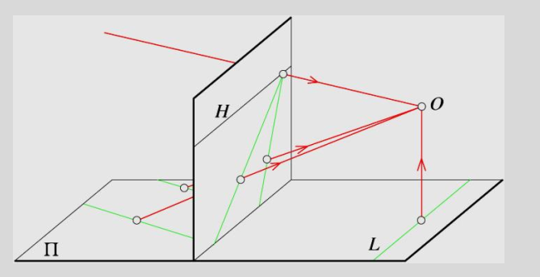

# Geometry in Perspective

- Points go to points

- Lines go to lines

- Polygons go to polygons

  

## Parallel lines in the world meet in the image "Vanishing Point"

Parallel lines intersect at **vanishing point**

### Line in 3-space

$$
x(t) = x_0 + at \\
y(t) = y_0 + at \\
z(t) = z_0 + at \\
$$

### Perspective Projection of the line

$$
x'(t) = \frac{fx}{z} = \frac{f(x_0 + at)}{z_0 + at} \\
y'(t) = \frac{fy}{z} = \frac{f(y_0 + bt)}{z_0 + at}
$$

In the limit as $$t \rightarrow \infin$$, $$x'(t) \rightarrow \frac{fa}{c}$$, $$y'(t) \rightarrow \frac{fb}{c}$$

### Vanishing points

- Each set of parallel lines (=direction) meets at a different point

- Sets of parallel lines on the same plane lead to collinear vanishing points.  The line is called the horizon for that plane.