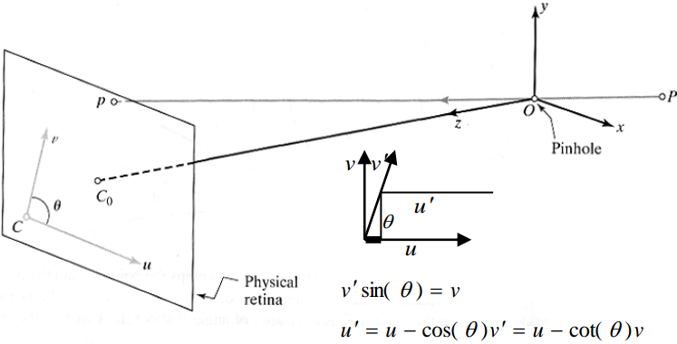

# Intrinsic Camera Calibration

## Intrinsic Parameters

From the 3D coordinates in the camera frame to the 2D image plane via projection.

### Ideal Perspective Projection

$$
u = f \frac{x}{z}
$$

$$
v = f \frac{y}{z}
$$

### Real Intrinsic parameters

1. **"Pixels" are in some arbitrary spatial units, maybe pixels are note square **
   $$
   u = \alpha \frac{x}{z} \\
   v = \beta \frac{y}{z}
   $$
   

2. **We don't know the origin of our camera pixel coordinates**
   $$
   u = \alpha \frac{x}{z} + u_0  \\
   v = \beta \frac{y}{z} + v_0
   $$

3. **Maybe skew between camera pixel axes**
   $$
   v' \sin(\theta) = v \\
   u' = u - \cos(\theta) v' =  u - \cot(\theta) v
   $$
   

## Intrinsic Parameters, Homogeneous coords

$$
\overrightarrow{p'}= K \space ^C \overrightarrow{p}
$$

$$
K = \begin{bmatrix} 
f & s & c_x \\
0 & af & c_y \\
0 & 0 & 1
\end{bmatrix}
$$

$$\overrightarrow{p'}$$: Pixels, $$\overrightarrow{p}$$: Camera 3D coordinates

**5 DOF**

where 

$$ f$$ - focal length, $$s$$ - skew, $$a$$ - aspect ratio, $$c_x, c_y$$ - offset

### If square pixels, no skew, and optical center is in the center

$$
K = \begin{bmatrix} 
f & 0 & 0 \\
0 & f & 0 \\
0 & 0 & 1
\end{bmatrix}
$$

Only 1 DOF