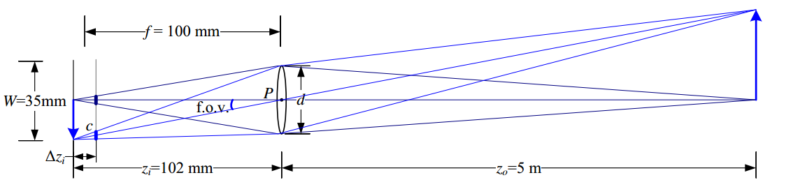
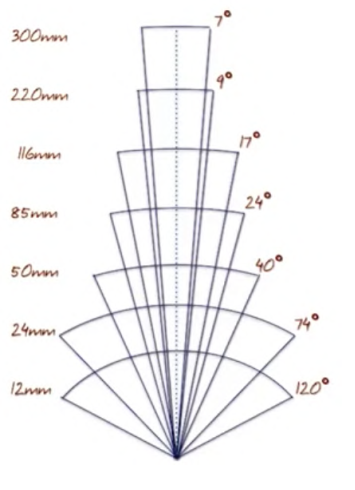

# Lenses

To avoid making the tradeoff of a pinhole camera model, we use lenses.

## Focal Length, $$f$$

The distance from the lens to the focal point.

Rays that pass through the center of a lens are unaffected.

## Lens Equation

For a given object distance, it will by fully "in focus" at a certain distance past the lens where three rays converge:

1. The ray **through** the center
2. The ray that **hits perpendicular** to the lens
3. They ray that **comes out perpendicular** to the lens.

This results in **lens equation**:
$$
\frac{1}{o} + \frac{1}{i} = \frac{1}{f}
$$

A thin lens of focal length $$f$$ focuses the light from a plane a distance $$z_0$$ in front of the lens at a distance $$z_i$$ behind the lens, where $$\frac{1}{z_0} + \frac{1}{z_i} = \frac{1}{f}$$ . If the **focal plane** (vertical gray line next to $$c$$) is moved forward, the images are no longer in focus and the circle of confusion c (small thick line segments) depends on the distance of the image plane motion $$∆z_i$$ relative to the lens aperture diameter d. The **field of view** (f.o.v.) depends on the
ratio between the sensor width $$W$$ and the focal length $$f$$ (or, more precisely, the focusing distance $$z_i$$, which is usually quite close to $$f$$)

Changing the object distance results in a similar change in the scale at which the at object is captured.  Changing the focal length, however, changes the optimal point at which we should capture the image.

We typically actually put our sensor at the focal plane.  If we put it too far from this point, we will get blur.  Thus the idea of "focusing" an object in an image is a matter of moving the sensor forward or backwards with respect to the lens:

## Field of View

The field of view depends on then sensor height $$h$$ and focal length $$f$$.
$$
\theta = 2 \tan^{-1}(\frac{h}{2f})
$$

Note that the relationship between focal length and filed of view is inversely proportional:

