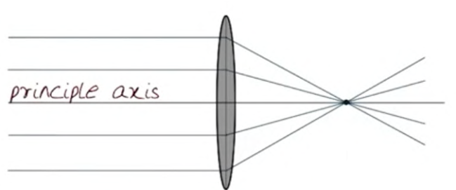
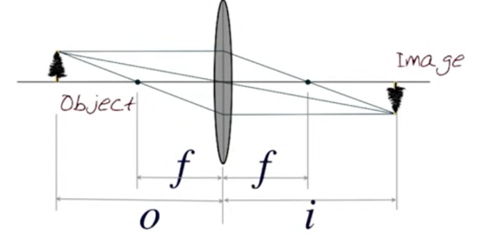

# Lenses

To avoid making the tradeoff of a pinhole camera model, we use lenses.

## Focal Length, $$f$$

The distance from the lens to the focal point.

Rays that pass through the center of a lens are unaffected.

## Lens Equation

For a given object distance, it will by fully "in focus" at a certain distance past the lens where three rays converge:

1. The ray **through** the center
2. The ray that **hits perpendicular** to the lens
3. They ray that **comes out perpendicular** to the lens.

This results in **lens equation**:
$$
\frac{1}{o} + \frac{1}{i} = \frac{1}{f}
$$
