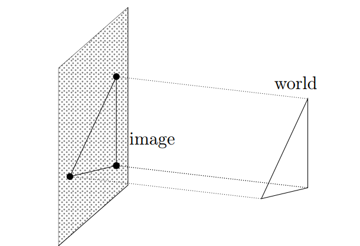

# Orthographic Projection

**Special case of perspective projection**

- Distance from the COP to the image plane is infinite
  => Both **f** and **Z** are very large

- Good approximation for telephoto optics

- Also called "parallel projection":
  $$
  (x, y, z) \rightarrow (x, y)
  $$
  

$$
\begin{bmatrix} 
1 & 0 & 0 & 0 \\
0 & 1 & 0 & 0 \\
0 & 0 & 0 & 0 
\end{bmatrix}
\begin{bmatrix} x \\
y \\
z \\
1
\end{bmatrix}
= 
\begin{bmatrix} x \\
y \\
1 \\

\end{bmatrix}
\rightarrow (x, y)
$$
