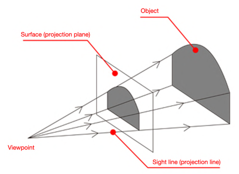
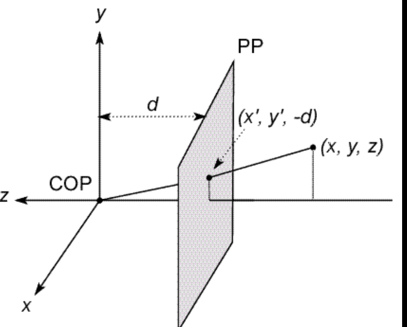

# Perspective Imaging

## Modeling projection – coordinate system

Use the pin-hole model as an approximation.

Put the optical center (Center of Projection) at the origin

Put the image plane (Projection Plane) in front of the Center of Projection

The camera looks down the negative z-axis, and the image plane has (0, 0) in the center, not the top-left corner.

