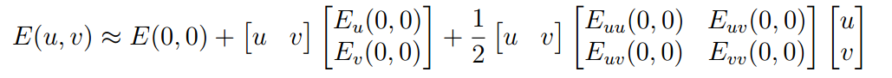
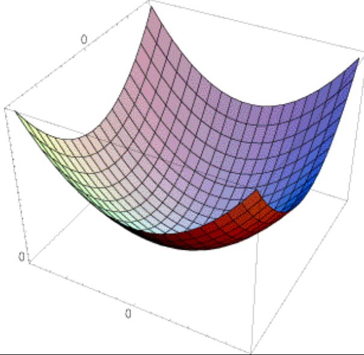

# Finding Corners

## Basic Idea

"**corner**": significant change in all directions with small shift

## Key Property

In the region around a corner, image gradient has two or more dominant directions.

## Harris Corners

Start with an image $$I$$, the change in appearance after shifting that image some (small) amount ($$u, v$$), over some window function $$w$$, is represented by an error function:
$$
E(u, v) = \sum_{x, y} w(x, y) [I(x + u, y +v) - I(x, y)]^2
$$


### Window Function

A Gaussian Filter that will weigh pixels near the center of the window appropriately.

### Taylor Expansion

We want a large error for a small shift that indicates a corner-like region.  We use Taylor expansions .

In 2D, the 2nd order Taylor Expansion about (0, 0):



Simplify:
$$
E(u, v) = \begin{bmatrix} u & v\end{bmatrix} M \begin{bmatrix}
u \\
v\end{bmatrix}
$$
Where **M** is a **second moment matrix**:
$$
M = \sum_{x, y} w(x, y) \begin{bmatrix} 
I_x^2 & I_xI_y \\
I_xI_y & I_y^2
\end{bmatrix}
$$

### Properties of the Second Moment Matrix

The surface $$E(u,v)$$ is locally approximated by a quadratic form.



Consider a constant "slice" of $$E(u,v)$$, this is the equation of an ellipse.

**Diagonalization** of **M**:
$$
M = R^{-1} \begin{bmatrix} \lambda_1 & 0  \\
0 & \lambda_2
\end{bmatrix}
R
$$
where $$\lambda$$s are the eigenvalues.

$$R$$ gives us the orientation of the ellipse and $$\lambda$$s give us the length of its major and minor axes.
$$
\lambda_1 \gg \lambda_2 \text{or} \lambda_2 \gg \lambda_1, \quad \text{edge} \\
\lambda_1, \lambda_2 \approx 0, \quad \text{flat region} \\
\lambda_1, \lambda_2 \gg 0 \text{and} \lambda_1 \sim \lambda_2, \quad \text{corner}
$$

### Harris Response Function

$$
R = \det{M}  - \alpha \text{trace}(M)^2 = \lambda_1 \lambda_2 - \alpha (\lambda_1 + \lambda_2) ^2
$$

Empirically, $$\alpha \in [0.04, 0.06]$$

The classification breakdown:
$$
|R| \approx 0, \quad \text{flat region} \\
R \ll 0, \quad \text{edge} \\
R \gg 0 , \quad \text{corner}
$$

## Harris Detector Algorithm

```
1. Compute Gaussian derivatives at each pixel
2. Compute second moment matrix M in a Gaussian window around each pixel
3. Compute corner response function R
4. Threshold R
5. Find local maxima of response function (nonmaximum suppression)
```

