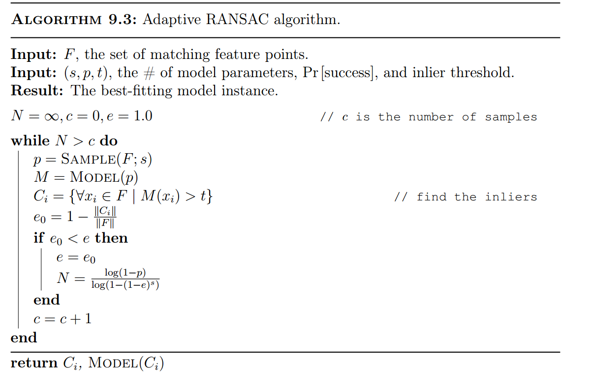

# RANSAC

**RANSAC = Random Sample Consensus Error Function**

RANSAC is an algorithm to find the right matches of features so can compute the pose/ transform/ fundamental ... the model.

## Basic Idea

Loop over a randomly-proposed model, find which points belong to it (inliers) and which don't (outliers), eventually choosing the model with the most inliers.

## Algorithm

1. **Sample** (randomly) the number of points required to fit the model
2. **Solve** the model parameters using sample
3. **Score** by the fraction of inliers within a preset threshold of the model.
4. Repeat 1-3 unitl the best model is found with high confidence.

## RANSAC for general model

### Minimal set

The smallest number of samples from which the model can be computed.

- Line: 2 points

Image transformations are models. Minimal set of $$s$$ of point pairs/matches:

- Translation: pick one pair of matched points
- Homography (for plane) - pick 4 point pairs
- Fundamental matrix - pick 8 point pairs 

### General RANSAC algorithm

- Randomly select $$s$$ points (or point pairs) to form a sample
- Instantiate the model
- Get consensus set $$C_i$$: The points within error bounds (distance threshold) of the world
- If $$|C_i| > T$$, terminate and return model.
- Repeat for $$N$$ trials, return model with max $$|C_i|$$

## Choosing the parameters

1. Initial number of points in the minimal set $$s$$:
   - Typically minimum number needed to fit the model
2. Distance threshold $$t$$
   - Assume location noise is Gaussian with $$\sigma ^2$$
   - For 95% cumulative threshold t when Gaussian with $$\sigma ^2$$: $$t^2 = 3.84 \sigma^2$$.  Choose $$t$$ so probability for inlier is high (e.g. 0.95)
3. Number of samples $$N$$
   - Choose $$N$$ so that, with probability $$p$$, at least one random sample set is free from outliers (e.g. $$p = 0.99$$)
   - Need to set $$N$$ based upon the outlier ratio $$e$$.

### Calculate N

**The number of features we found is completely irrelevant!**

1. 𝑠 – number of points to compute solution
2. 𝑝 – probability of success
3. 𝑒 – proportion outliers, so % inliers =(1 − 𝑒)
4. 𝑃 (𝑠𝑎𝑚𝑝𝑙𝑒 𝑠𝑒𝑡 𝑤𝑖𝑡ℎ 𝑎𝑙𝑙 𝑖𝑛𝑙𝑖𝑒𝑟𝑠) = $$(1 − 𝑒)^𝑠$$
5. 𝑃(𝑠𝑎𝑚𝑝𝑙𝑒 𝑠𝑒𝑡 𝑤𝑖𝑙𝑙 ℎ𝑎𝑣𝑒 𝑎𝑡 𝑙𝑒𝑎𝑠𝑡 𝑜𝑛𝑒 𝑜𝑢𝑡𝑙𝑖𝑒𝑟) = $$(1 − (1 − 𝑒)^𝑠)$$
6. 𝑃(𝑎𝑙𝑙 𝑁 𝑠𝑎𝑚𝑝𝑙𝑒𝑠 ℎ𝑎𝑣𝑒 𝑜𝑢𝑡𝑙𝑖𝑒𝑟) = $$(1 − (1 − 𝑒)^𝑠)^N$$
7. We want 𝑃(𝑎𝑙𝑙 𝑁 𝑠𝑎𝑚𝑝𝑙𝑒𝑠 ℎ𝑎𝑣𝑒 𝑜𝑢𝑡𝑙𝑖𝑒𝑟) < (1 − 𝑝)
8. So $$(1 − (1 − 𝑒)^𝑠)^N < (1 - p)$$

$$N > \log(1-p) / \log(1-(1-e)^s)$$

$$N = f(e, s, p)$$, **but not the number of points**!

## Adaptive RANSAC algorithm

## Example: Estimating a Homography

1. Select 4 feature pairs (at random)
2. Compute homography 𝑯 (exact)
3. Compute inliers where 𝑆𝑆𝐷(𝑝𝑖’, 𝑯 𝑝𝑖 ) < 𝜀
4. Keep largest set of inliers
5. Re-compute least-squares 𝑯 estimate on all of the inliers

## Benefits and Downsides

### Good

- Simple and general
- Applicable to many different problems, often works well in practice
- Robust to large numbers of outliers
- Applicable for larger number of parameters than Hough transform
- Parameters are easier to choose than Hough transform

### Downside

- Computational time grows quickly with the number of model parameters
- Not as good for getting multiple fits
- Really not good for approximate models

## Common applications of RANSAC

- Computing a homography (e.g. image stitching) or other image transform
- Estimating fundamental matrix (relating two views)
- Pretty much every problem in robot vision