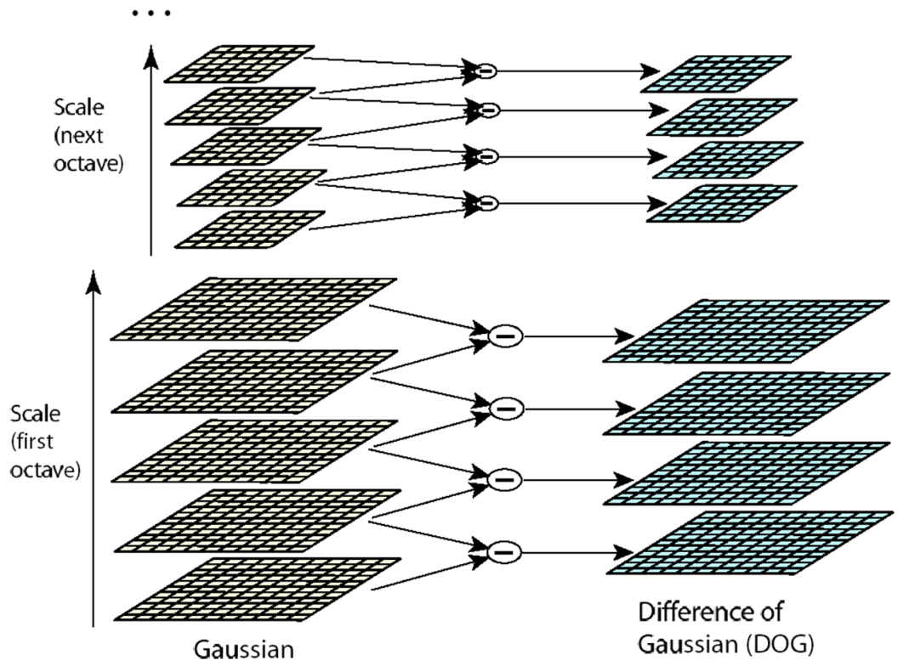

# Scale Invariance

**Harris Detector is invariant under changes involving rotation and intensity, but they are not invariant under scaling.**

**Solution**:

- Design a function on the region (circle), which is "scale invariant" - not affected by the size but will be the same for "corresponding regions"

## SIFT Detector

**SIFT: Scale Invariant Feature Transform**

### General Idea

Find robust extreme (maximum or minimum) both in space and scale.

Use DoG (Difference of Gaussian) **pyramid** (Laplacian Pyramid) to find maximum values, then eliminate “edges” and pick only corners.

### Key Point Localization

Each point is compared to its 8 neighbors in the current image and 9 neighbors each in the scales above and below

## Harris-Laplace Detector

Harris-Laplace Detector combines the difference of Gaussians with the Harris Detector: we find the local maximum of the Harris corner in space and the Laplacian in scale.