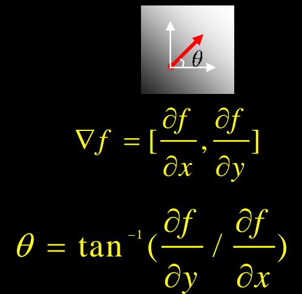

# Extensions - using the gradient

The most common extension to Hough Transform leverages the gradient, where we eliminate the loop over all possible $$\theta$$s.

```
Initialize H[d, theta] = 0
For each edge point in E(x, y) in the image
	theta = gradient at (x, y)
    d = x * cos(theta) + y * sin(theta)
    H[d, theta] += 1
Find the value(s) of (d, theta) of (d, theta) where H[d, theta] is maximum
The detected line in the image is gvien by d = x * cos(theta) + y * sin(theta)
```



## Extension 2

Give more votes for stronger edges

## Extension 3

change the sampling of $$(d, \theta)$$$ to give more/less resolution

## Extension 4

The same procedure can be used with circles, squares, or any other shape