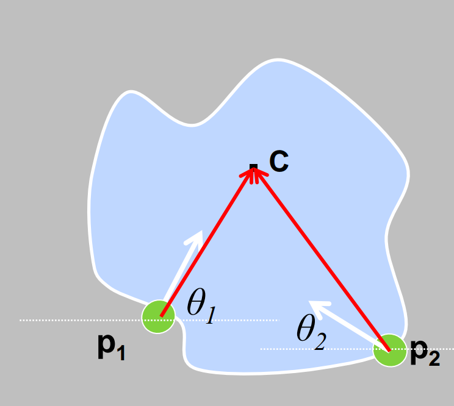
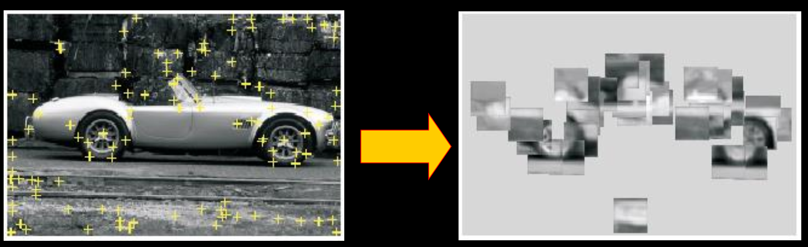

# Generalization - Hough Table

**Non-analytic model**

Parameters express variation in pose or scale fixed but arbitrary shape (fixed parameters like circles with radius r).  (out-dated)

**Visual code-words** based features

Not edges but detected templates learned from models (this is “now”)

Previously, we know how to vote given a particular pixel because we had solve the equation for the shape.  For an arbitrary shape, we instead determine how to vote by building a **Hough Table**

## Hough Table

**A Hough Table stores displacement vectors for a particular gradient angle $$\theta$$.**



### Training: build a Hough Table

1. At each boundary point, compute displacement vector: $$r =  c - p_i$$
2. Measure the gradient angle $$\theta$$ at the boundary point.
3. Store that displacement in a table indexed by $$\theta$$

### Recognition

1. At each boundary point, measure the gradient angle $$\theta$$
2. Look up all displacements in $$\theta$$ displacement table.
3. Vote for a center at each displacement.


## Algorithm

### Orientation is known

```
For each edge point
	Compute gradient direction θ
	Retrieve displacement vectors r to vote for reference point.
Peak in this Hough space (X,Y) is reference point with most supporting edges
```

### Orientation is unknown

```
For each edge point
    For each possible master θ*
        Compute gradient direction θ
        New θ’ = θ - θ*
        For θ’ retrieve displacement vectors r to vote for reference point.
```

Peak in this Hough space (now X,Y, θ*) is reference point with most supporting edges

### Scale S is unknown

```
For each edge point
    For each possible master scale S:
        Compute gradient direction θ
        For θ’ retrieve displacement vectors r
        Vote r scaled by S for reference point.
```

Peak in this Hough space (now X,Y, S) is reference point with most supporting edges

## Training: Visual code-words

1. Build codebook of patches around extracted interest points using clustering 


2. Map the patch around each interest point to closest codebook entry



3. For each codebook entry, store all displacements relative to object center

