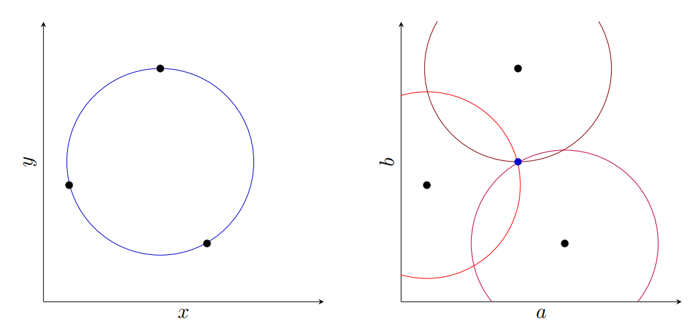
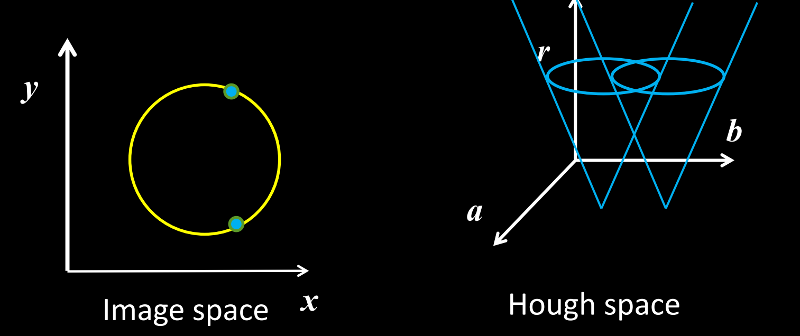
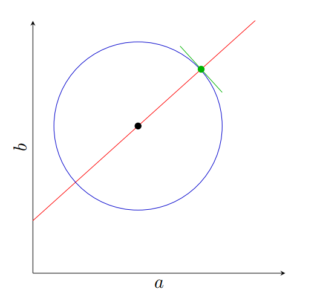

# Hough transform: Circles

## Circle

$$
(x - a)^2 + (y - b)^2 = r^2
$$

### Radius is known

A point in image space on a circle is a circle in Hough space. Thus, each point on the not-yet-defined circle votes for a set of points surrounding that same location in Hough space at the known radius.



### Radius is unknown

#### No gradient

Each point on the circle in image space votes on a set of values in Hough space resembling a **cone**.



#### With gradient

We can overcome this growth problem by taking advantage of the  gradient, much like we did in the Extensions for the Hough algorithm to reduce the range of $$\theta$$.  We can visualize the gradient as being a tangent line of the circle: if we know the radius, a single point and its tangent line would be enough to define the circle.  Since we don't, there's a line of possible values for the center.  As we see in this figure, where the blue circle is the circle defined for a specific radius given the green point and its gradient direction.  The red line defines the range of possible locations for the center of the circle if we don't know the radius.

With each point in image space now defining a line of votes in Hough space, we've drastically improved the computational complexity of voting process despite increasing the dimension.



## Algorithm

```
For every edge pixel (x,y) :
	For each possible radius value r:
		For each possible gradient direction θ:
			%% or use estimated gradient
				a = x – r cos(θ)
				b = y + r sin(θ)
				H[a,b,r] += 1
		end
	end
end
```

