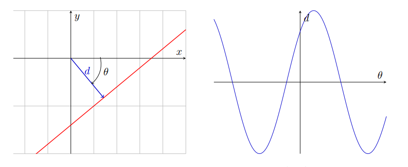

# Polar Representation of Lines

## Cartesian vs. Polar Spaces

$$
x \cos{\theta} + y \sin \theta = d
$$

If we know $$x$$ and $$y$$, then what we have left in terms of $$d$$ and $$\theta$$ is a sinusoid.

