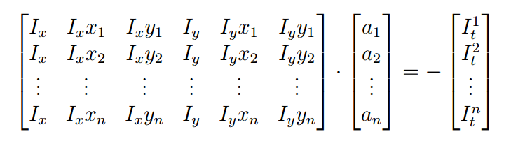

# Geometric Motion Constraints

Recall brightness constancy equation:
$$
I_x \cdot u + I_y \cdot v + I_t  = 0 \\
$$
Substitute affine transformation:
$$
I_x (a_1 + a_2x +a_3y) + I_y (a_4 + a_5x +a_6y) + I_t  = 0
$$
Use least square minimization:
$$
Err(\overrightarrow a) = \sum [I_x (a_1 + a_2x +a_3y) + I_y (a_4 + a_5x +a_6y) + I_t]^2
$$
Minimize squared error:

