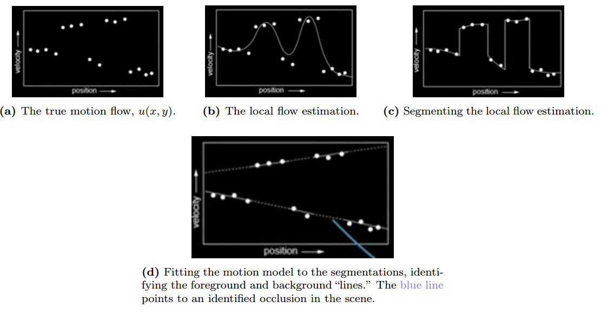

# Layered Motion

The basic idea behind layered motion is to break the image sequence into "layers" which all follow some coherent motion model.

## 1. Steps

### Step 1: Get an approximation of the "local flow" via LK or other methods

### Step 2: Obtain a set of initial affine motion hypotheses

- Divide the image into blocks and estimate affine motion parameters in each block by least squares.
- Perform k-means clustering on affine motion parameters

### Step 3: Iterate until convergence:

- Assign each pixel to best hypothesis.
  - Pixels with high residual error remain unassigned.
- Perform region filtering to enforce spatial constraints.
- Re-estimate affine motions in each region

The implementation difficulties lie in identifying segments and clustering them appropriately to fit the intended motion models.