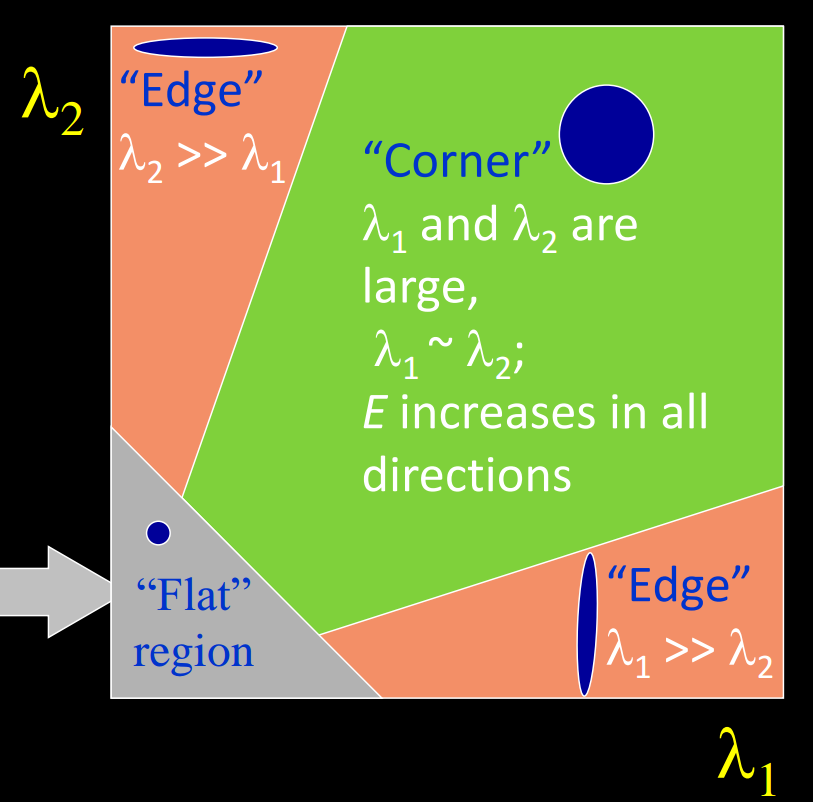
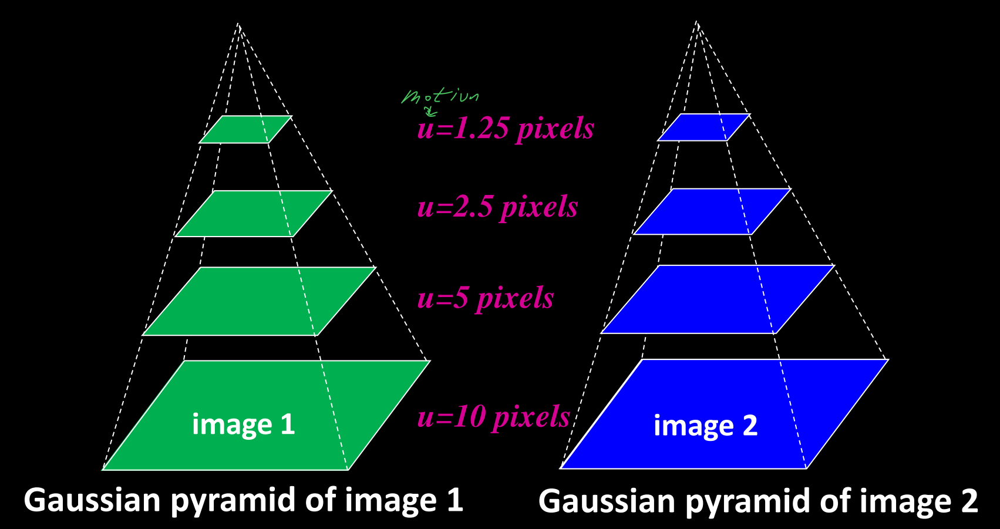
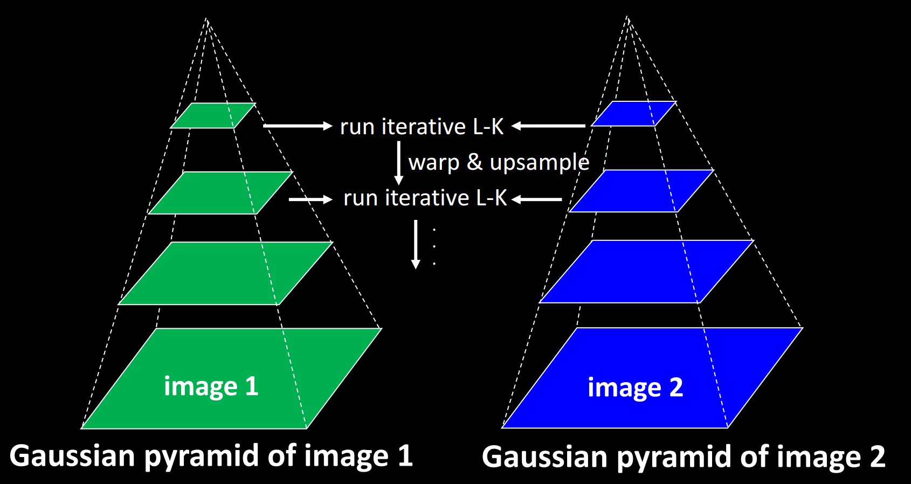
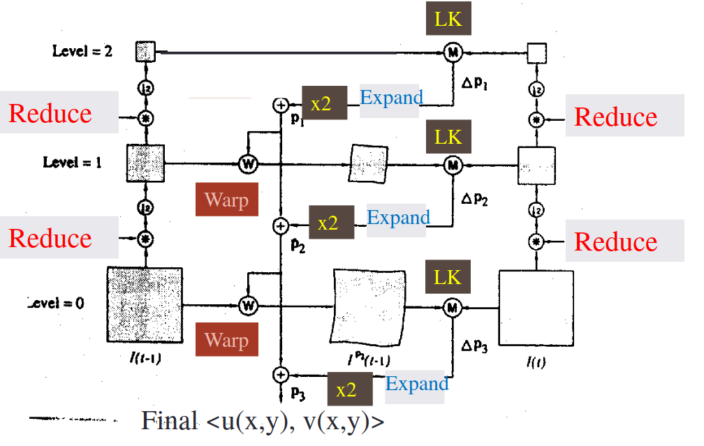
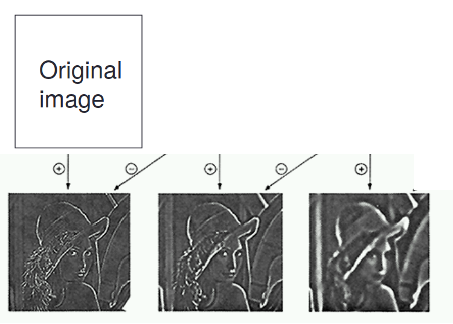
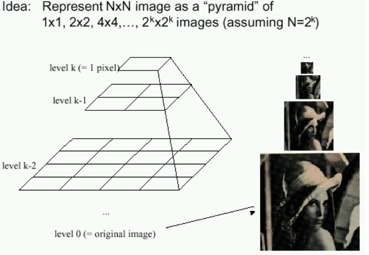
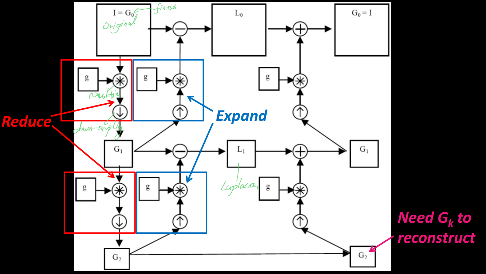
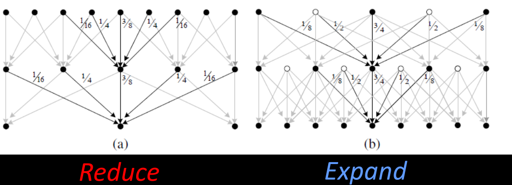

# Dense flow: Lucas and Kanade

Recall gradient component of flow:
$$
I_xu + I_yv + I_t = 0
$$

Solving the aperture problem:

**Basic idea: Impose local constraints to get more equations for a pixel.**

- e.g: assume that the flow field is smooth locally.

## 1. Lucas Kanade

### 1.1 Assumption

Assume the pixel's neighbors have the same $$(u,v)$$:

- If we use a 5x5 window, that gives us 25 equations per pixel.
  $$
  \underbrace{
  \begin{bmatrix}
  I_x(p_1) & I_y(p_1) \\
  I_x(p_2) & I_y(p_2) \\
  ... & ... \\
  I_x(p_25) & I_y(p_{25}) \\
  \end{bmatrix}
  }_{\boldsymbol{A},25 \times 2}
  \underbrace{
  \begin{bmatrix}
  u \\
  v
  \end{bmatrix}
  }_{\boldsymbol{d}, 2\times1}
  = - 
  \underbrace{
  \begin{bmatrix}
  I_t(p_1) \\
  I_t(p_2) \\
  ...  \\
  I_t(p_{25})\\
  \end{bmatrix}
  }_{\boldsymbol{b},25 \times 1}
  $$
  This time, we have more equations than unknowns. 

### 1.2 Least Squares

Thus, we can use the standard **least squares** method on over-constrained system to find the best approximate solution: $$\boldsymbol{(A^TA)d = A^T b}$$, or in matrix form:
$$
\begin{bmatrix}
\sum I_xI_x & \sum I_xI_y \\
\sum I_xI_y & \sum I_yI_y 
\end{bmatrix}

\begin{bmatrix}
u \\
v
\end{bmatrix}
= - 

\begin{bmatrix}
\sum I_xI_t \\
\sum I_yI_y 
\end{bmatrix}
$$

Minimize $$||Ad - b|| ^2$$

### 1.3 Conditions for solvability

When is this solvable?

- $$A^TA$$ should be invertible
- So $$A^TA$$ should be well-conditioned: $$\lambda_1 / \lambda_2$$ should not be too large ($$\lambda_1$$: larger eigenvalue)

Recall the Harris corner detector: $$M = A^T A$$ is the second moment matrix, the eigenvectors and eigenvalues of $$M$$ relate to edge direction and magnitude.

### 1.4 Errors in Lucas-Kanade

- Brightness constancy does not hold:

  Do exhaustive neighborhood search with normalized correlation - tracking features – maybe SIFT – more later….

- A point does not move like its neighbors:

  Motion segmentation

- The motion is large (larger than a pixel) - Taylor doesn't hold
  - Not-linear: iterative refinement
  - Local minima: coarse-to-fine estimation

## 2. Hierarchical LK

Hierarchical Lukas-Kanade is used if the motion is too big.  To overcome aliasing, **coarse-to-fine estimation** is used.

### 2.1 General idea

we can make large changes seem smaller by just making the image smaller.  To do that, we introduce the idea of **Gaussian Pyramids**.

We create a Gaussian pyramid for each of our images in time, then build our motion field from the lowest level.

### 2.2 Steps

We start at the highest level in the image pyramids which contain the smallest images.  We calculate the flow field using standard (or iterative) Lucas-Kanade.  This flow field is small, but if we expand the image and double the flow field, we can get a rough approximation of the *next* pyramid's flow field.

With that approximate flow field, we can warp (Image Rectification)  the actual $$P_{t-1}^{-2}$$ towards $$P_{t}^{-2}$$.   This generate "intermediate" image.

### 2.2 Procedure

1. Compute Iterative LK at level

2. Initialize $$u_{K+1}, v_{K+1} = 0$$ at size of level $$K+1$$

3. For each level $$i$$ from $$K$$ to 0:

   - Upsample (expand) $$u_{i+1},v_{i+1}$$ to create $$u_i^p,v_i^p$$ flow fields of now twice resolution as level $$i+1$$

   - Multiply $$u_i^p,v_i^p$$ by 2 to get predicted flow

   - Warp level $$i$$ Gaussian version of $$I_2$$ according to predicted flow to create $$I_2'$$

   - Apply LK between $$I_2'$$ and level $$i$$ Gaussian version of $$I_1$$ to get $$u_i^{\delta}, v_i^{\delta}$$ (the correction in flow)

   - Add corrections to obtain the flow $$u_i, v_i$$ at i-th level, i.e.:
     $$
     u_i = u_i^p + u_i^\delta \\
     v_i = v_i^p + v_i^\delta \\
     $$

## 3. Image Pyramid

### 3.1 Laplacian Pyramid

### 3.2 Gaussian Pyramid (image pyramid)

### 3.3 Computing the Laplacian Pyramid

### 3.4 Reduce and Expand

**Reduce**: apply "5-tap" (1 4 6 4 1 ) / 16 separable filter to make reduced image

**Expand**: Apply different “3-tap” separable filters for even and odd pixels to make expanded image.

## 4. Sparse Flow

Sparse LK is a variant of Hierarchical Lucas-Kanade that is only applied to interest points.