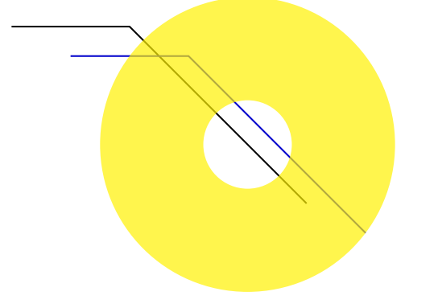

# Motion Estimation

The motion estimation techniques fall into two categories:  

## 1. Feature-Based Methods

- Extract visual features (corners, textured areas) and track them over multiple frames

- Sparse motion fields, but more robust tracking

- Suitable when image motion is large (10s of pixels)

  We have seen much of this method in **Feature Recognition**.

## 2. Direct, Dense Methods

- Directly recover image motion at each pixel from spatio-temporal image brightness variantions
- Dense motion fields, but sensitive to appearance variations.
- Suitable for video and when image motion is small. 

### 2.1 Optic Flow

Optic flow is the apparent motion of objects or surfaces.

#### 2.1.1 Problem Definition

How to estimate pixel motion from image $$I(x, y, t)$$ to $$I(x, y, t + 1)$$

- Given a pixel in $$I(x,y,t)$$, look for nearby pixels of the same color in $$I(x,y,t+1)$$

#### 2.1.2 Assumptions

- **Color Constancy**: a point in $$I(x,y,t)$$ looks the same in $$I(x',y',t+1)$$.  For grayscale images, this is **brightness constancy**.
  $$
  I(x,y,t) = I(x+u, y+v, t+1)
  $$
  

- **Small Motion**: points do not move very far

Taylor series expansion of $$I$$:
$$
I(x+u, y+v) \approx I(x,y) + \frac{\part{I}}{\part{x}}u + \frac{\part{I}}{\part{y}}v
$$
Combining these two constraints together: 

#### 2.2.3 Brightness Constancy Constraint Equation

$$
I_xu + I_yv + I_t = 0
$$

2 unknowns $$(u,v)$$ but 1 equation!

**What does this constraint mean?**

- The component of the flow in the gradient direction is determined
- The component of the flow parallel to an edge is unknown

**Aperture problem**

### 2.2 Smooth Optical Flow

How much we violate motion brightness equation?

#### 2.2.1 Formulate Error in Optical Flow Constraint

- **Global Error Function**

$$
e_c = \iint_{image} (I_xu + I_yv + I_t)^2dxdy
$$

- **Smoothness constraint**: Motion field tends to vary smoothly over the image.  This punishes large changes to $$u, v$$ over the image.

$$
e_s = \iint_{image} (u_x^2 + u_y^2) + (v_x^2 + v_y^2) dxdy
$$

Combining both constraint, find $$(u,v)$$ at each image point that minimizes:
$$
e = e_s + \lambda e_c
$$

### 2.3 Dense Flow Summary

- Impose a constraint on the flow field in general to make the problem solvable
- Strength: Allow you to bias your solution with a prior
- But there are better ways to increase the number of equations.