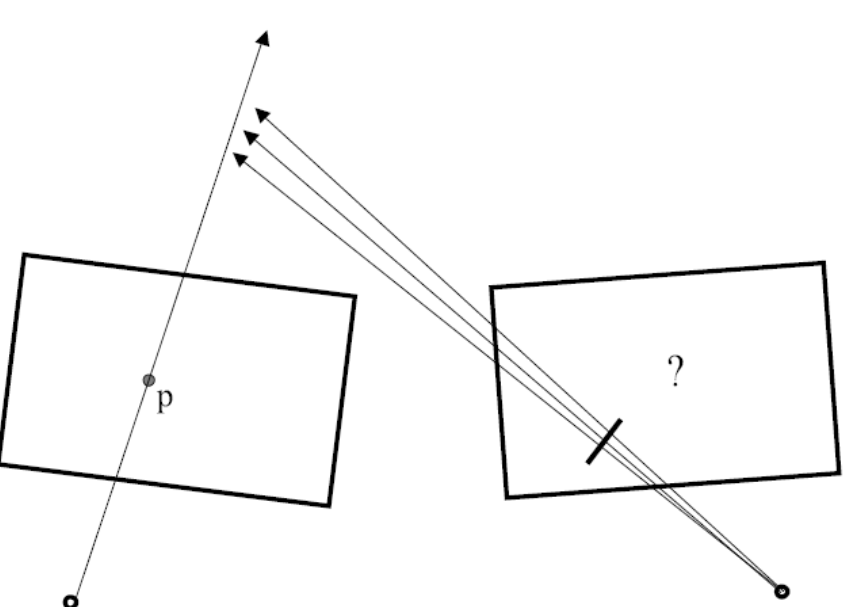
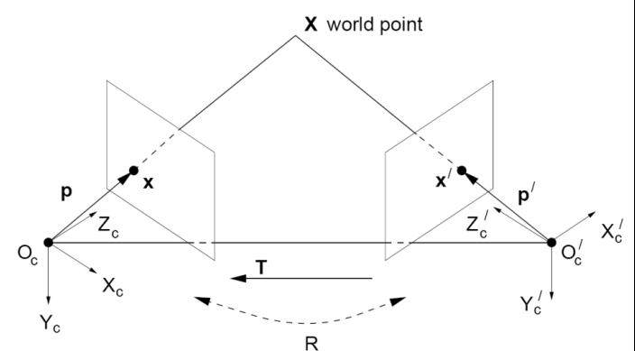

# Essential Matrix

## 1. Motivating the problem: Stereo

Given two views of a scene (the two cameras not necessarily having optical axes), what is the relationship between the location of a scene point in one image and its location in the other?

## 2. Assumption

We have **calibrated** cameras, so we know the transformation from one origin to the other: 

Some translation $$\pmb{t}$$ and rotation $$\pmb{R}$$, this means:
$$
\pmb{x_2 = Rx_1 + t}
$$

## 3. Essential Matrix

Cross both sides by $$t$$:
$$
\pmb{t} \times \pmb{x_2 = t \times Rx_1 + t \times t} \\
= \pmb{t \times Rx_1}
$$
Dot both sides with $$x_2$$:
$$
\pmb{x_2 \cdot} (\pmb{t} \times \pmb{x_2)} = \pmb{x _2 \cdot (t \times Rx_1)} \\
\pmb{0 = x_2 \cdot (t \times Rx_1)}
$$
Suppose $$\pmb{E=[t_x]R}$$, this means:
$$
\pmb{x_2^T Ex_1 = 0}
$$
**$$\pmb{E}$$ is called the "essential matrix"**, it is a expression relating the two points on the two image planes.

