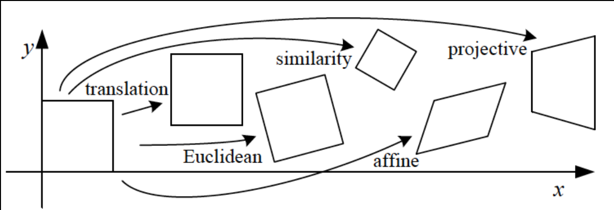

# Image-to-Image Projections

## 2D Transformation

### Projective Transformation Matrix

For 2D images it's a 3x3 matrix applied to homogeneous coordinates
$$
\begin{bmatrix} x' \\
y' \\
w'
\end{bmatrix}
 = \begin{bmatrix} 
 a & b & c \\
 d & e & f \\
 g & h & i
 \end{bmatrix}
 \begin{bmatrix} x \\
y \\
w
\end{bmatrix}
$$

## Special Projective Transformations

These are homogeneous coordinates

### Translation

$$
\begin{bmatrix} x' \\
y' \\
1
\end{bmatrix}
 = \begin{bmatrix} 
 1 & 0 & t_x \\
 0 & 1 & t_y \\
 0 & 0 & 1
 \end{bmatrix}
 \begin{bmatrix} x \\
y \\
1
\end{bmatrix}
$$

**Preserves**:

- Length/Areas
- Angles
- Orientation
- Lines

**Number of pairs of points needed to compute**: 1 (2 unknowns)

### Euclidean

$$
\begin{bmatrix} x' \\
y' \\
1
\end{bmatrix}
 = \begin{bmatrix} 
 \cos(\theta) & -\sin(\theta) & t_x \\
 \sin(\theta) & \cos(\theta) & t_y \\
 0 & 0 & 1
 \end{bmatrix}
 \begin{bmatrix} x \\
y \\
1
\end{bmatrix}
$$

**Preserves**:

- Length/Areas
- Angles
- Lines

**Number of pairs of points needed to compute**: 2 (3 unknowns)

### Similarity

$$
\begin{bmatrix} x' \\
y' \\
1
\end{bmatrix}
 = \begin{bmatrix} 
 a\cos(\theta) & -a\sin(\theta) & t_x \\
 a\sin(\theta) & a\cos(\theta) & t_y \\
 0 & 0 & 1
 \end{bmatrix}
 \begin{bmatrix} x \\
y \\
1
\end{bmatrix}
$$

**Preserves**:

- Ratios of Areas
- Angles
- Lines

**Number of pairs of points needed to compute**: 2 (4 unknowns)

### Affine

$$
\begin{bmatrix} x' \\
y' \\
1
\end{bmatrix}
 = \begin{bmatrix} 
 a & b & c \\
 d & e & f \\
 0 & 0 & 1
 \end{bmatrix}
 \begin{bmatrix} x \\
y \\
1
\end{bmatrix}
$$

**Preserves**:

- Parallel lines
- Ratio of Areas
- Lines

**Number of pairs of points needed to compute**:  3 (6 unknowns)

### Homography

$$
\begin{bmatrix} x' \\
y' \\
1
\end{bmatrix}
= \begin{bmatrix}
wx' \\
wy' \\
w
\end{bmatrix}
 = \begin{bmatrix} 
 a & b & c \\
 d & e & f \\
 g & h & 1
 \end{bmatrix}
 \begin{bmatrix} x \\
y \\
1
\end{bmatrix}
$$

**Preserves**:

- Lines

**Number of pairs of points needed to compute**: 4 (8 unknowns)