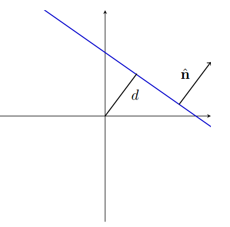
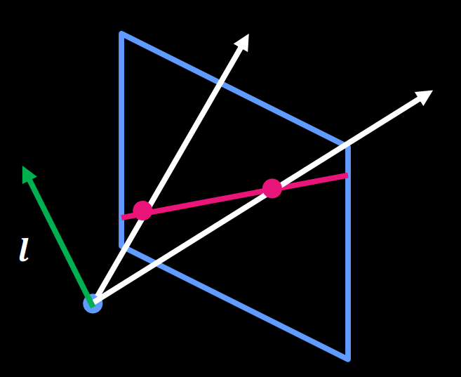
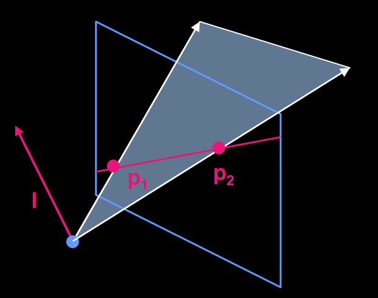
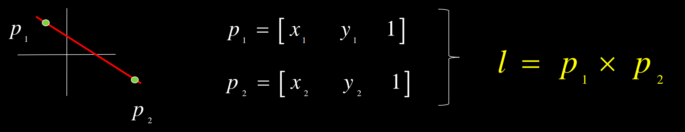
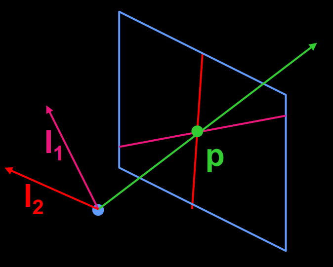
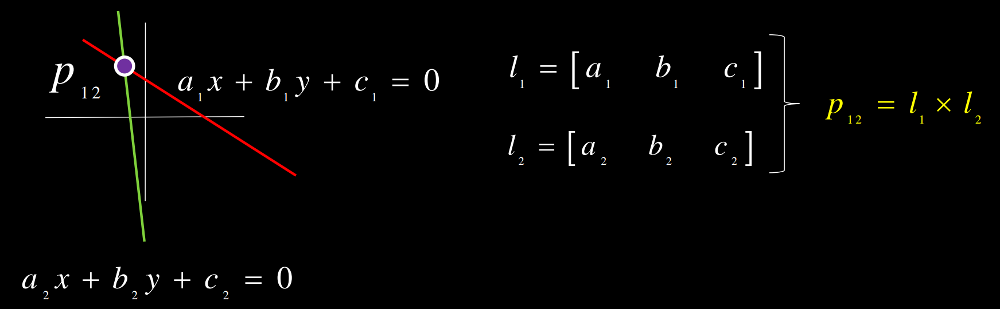
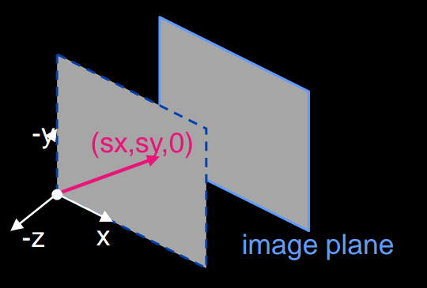
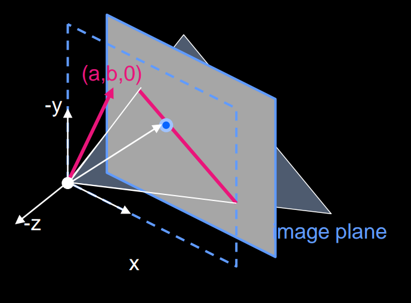

# Projective Geometry

Mathematics behind projective geometry.

## 1. Alternative Interpretations of Lines

$$
ax + by + c = 0
$$

Represent it in dot product:
$$
[a \quad b \quad c] \cdot [x \quad y \quad 1] = 0
$$
An alternative definition of the dot product:
$$
\pmb{a} \cdot \pmb{b} = ||\pmb{a}||||\pmb{b}|| \cos \theta
$$
This indicates that the vector $$[a \quad b \quad c]$$ is perpendicular to every point (x,y) in the $$z=1$$ plane, or the ray passing through the origin and the point $$(x, y, 1)$$

We can also define the line by its distance from the origin $$d $$, and normal vector $$\pmb{\hat{n}} = [n_x, n_y]$$ 

So a line can be represented as $$[a \quad b \quad c]$$ or $$[n_x, n_y, -d]$$

## 2. Point-line Duality

**We can represent any line on our image plane by a point in the world using its constants.** The point defines a normal vector for a plane passing through the origin that creates the line where it intersects the image plane.

A line is a plane of rays through origin defined by the normal $$l = (a, b, c)$$.  All rays (x,y,z)  satisfying: $$ax + by + cz = 0$$

### 3. Point and line duality

A line $$l$$ is a homogeneous 3-vector, it is perpendicular to every point (ray) $$p$$ on the line: $$l^T p = 0$$

### 3.1 Points to line

$$
l = p_1 \times p_2
$$

### 3.2 Lines to Point

$$
p = l_1 \times l_2
$$

**Points and lines are dual in projective space**

- Given any formula, can switch the meanings of points and lines to get another formula

## 3. Ideal Points and Lines

### 3.1 Ideal Points

Point at infinity

$$p = (x, y, 0)$$ - parallel to image plane. It has infinite image coordinates

### 3.2 Ideal Line

$$I = (a, b, 0)$$ - normal is parallel to image plane.  Corresponds to a line in the image (finite coordinates)

- Goes through image origin (principle point)

## 4. Duality in 3D

We can extend this notion of point-line duality int 3D

Recall the equation of a plane:
$$
ax + by + cz + d = 0
$$

where $$(a, b, c)$$ is the normal of the plane, and $$d = ax_0 + by_0 + cz_0$$ for some point on the plane $$(x_0, y_0, z_0)$$. 

A plane $$N$$ is defined by a 4-vector $$[a, b, c, d]$$, and so $$\pmb{N} \cdot \pmb{p} = 0$$