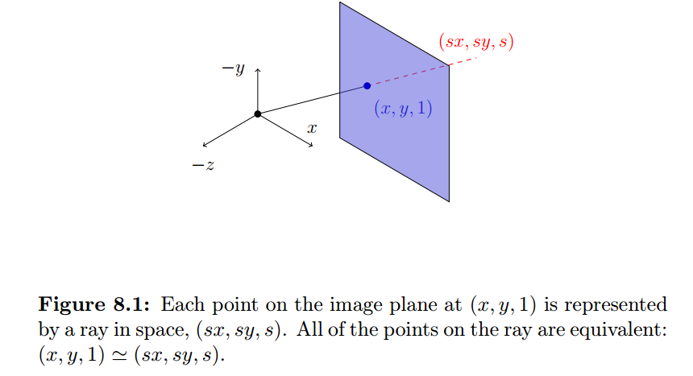
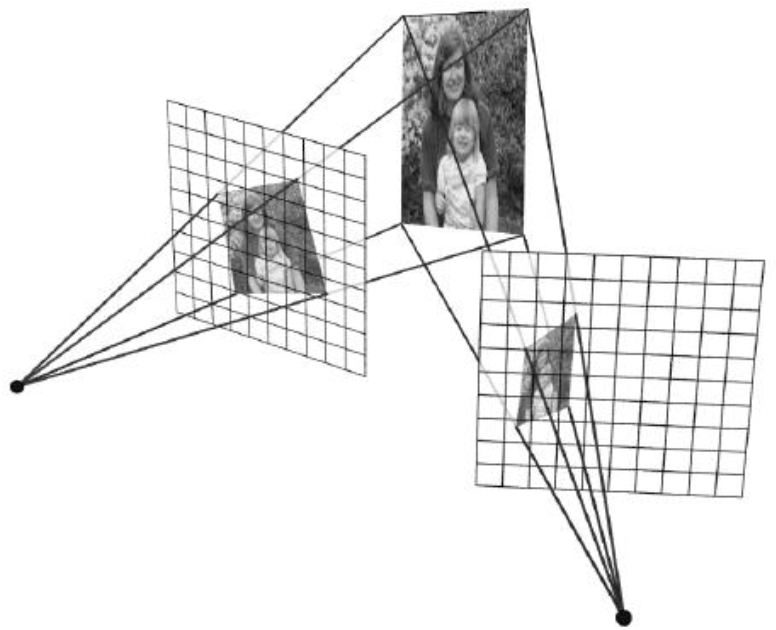
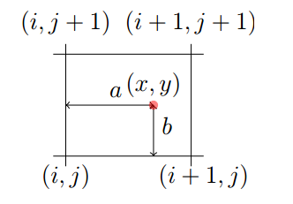

# The Power of Homographies

**Why do homogeneous coordinates make sense?**

The point on the image plane at $$(x, y, 1)$$ is just the intersection of the ray with the image plane; that means any point on the ray projects onto the image plane at that point.

The ray is just the scaled intersection point, $$(sx, sy, s)$$

**How we determine how a particular point in one projective plane maps onto another plane?**

We cast a ray through each pixel in the first projective plane and draw where that ray intersects the other projective plane.

**Homgraphies allow us to map projected points from one plane to another.**

Now we can think about this as a 2D **image warp** (or just a transformation) from one plane to another.  This basic principle is how we create **image mosaics (panoramas)**.

## Creating Panoramas (mosaic)

### Basic Procedure

- Take a sequence of images from the same position, rotate the camera about its optical center
- Compute transformation between second image and first
- Transform the second image to overlap with the first
- Blend the two together to create a mosaic
- (If there are more images, repeat)

### Image Reprojection: Homography

A projective transform is a mapping between any two PPs with the same center of projection, called Homography.
$$
\begin{bmatrix}
wx' \\
wy' \\
w
\end{bmatrix}
 = \begin{bmatrix} 
 a & b & c \\
 d & e & f \\
 g & h & 1
 \end{bmatrix}
 \begin{bmatrix} x \\
y \\
1
\end{bmatrix}
$$
also can be written as :
$$
p' = Hp
$$

### Solving for homographies

1. **Inhomogeneous Solution**

Set this up as a system of linear equations with a vector $$h$$ of 8 unknowns: $$Ah= b$$.  Given at least 4 corresponding points between the images, we can solve for $$h$$ using the least squares method: $$\min||Ah - b||^2$$

2. **Single Value Decomposition (SVD), better way** 

Just like we did for the extrinsics, multiply through, and divide out by w. Gives two homogeneous
equations per point. Solve using SVD just like before. This is the cool way.

## Homographies and 3D Planes

In this section we'll demonstrate how the 8 degrees of freedom in a homography allow us to create mappings between planes.

Recall the calibration matrix and its effect on world-space coordinates:
$$
\begin{bmatrix} 
u \\
v \\
1 \\
\end{bmatrix} 
=  \begin{bmatrix} 
m_{00} && m_{01} && m_{02} && m_{03}\\
m_{10} && m_{11} && m_{12} && m_{13}\\
m_{20} && m_{21} && m_{22} && m_{23}
\end{bmatrix} 
\begin{bmatrix} 
x \\
y \\
z \\
1
\end{bmatrix}
$$
Suppose all of the points in the world were lying on a plane.  A plane is represented by a normal vector and a point on the plane, represented as $$d = ax +by + cz$$.  Rearrange to solve for $$z: z = \frac{d + ax + by}{-c}$$ , and then plug into our transformation:
$$
\begin{bmatrix} 
u \\
v \\
1 \\
\end{bmatrix} 
=  \begin{bmatrix} 
m_{00} && m_{01} && m_{02} && m_{03}\\
m_{10} && m_{11} && m_{12} && m_{13}\\
m_{20} && m_{21} && m_{22} && m_{23}
\end{bmatrix} 
\begin{bmatrix} 
x \\
y \\
\frac{d - ax - by}{c} \\
1
\end{bmatrix}
$$
The effect of the 3rd column can be spread to other columns, this gives us:
$$
\begin{bmatrix} 
u \\
v \\
1 \\
\end{bmatrix} 
=  \begin{bmatrix} 
m_{00}' && m_{01}' && 0 && m_{03}'\\
m_{10}' && m_{11}' && 0 && m_{13}'\\
m_{20}' && m_{21}' && 0 && m_{23}'
\end{bmatrix} 
\begin{bmatrix} 
x \\
y \\
\frac{d - ax - by}{c} \\
1
\end{bmatrix}
$$
Now this is a 3x3 homogoraphy!

## Image Rectification

We can transform between arbitrary planes using homographies, we can actually apply that to images to see what they would look like from a different perspective!

This is called **image rectification**.

### Image Warping

Given a coordinate transform and a source image $$f(x, y)$$, how do we compute a transformed image $$g(x', y') = f(T(x, y))$$?

#### Forward Warping

Send each pixel $$f(x,y)$$ to its corresponding location $$(x', y') = T(x, y)$$  

The problem is that the a particular $$(x', y') = T(x, y)$$  may not correspond to an individual pixel!  This is know as **splatting**, and does not result in very clean transformed images.

#### Inverse Warping

Get each pixel $$g(x', y')$$ from its corresponding location $$(x,y) = T^{-1}(x', y')$$ in the first image.

**Bilinear Interpolation**

Given a location, we can find its distance from a discrete pixel at (i, j): $$a = x - i, b = y - j$$.  Then we calculate the final intensity in the destination image at $$(x', y')$$:
$$
f(x, y) = (1 - a)(1-b) \quad f[x,y] \\
+ a(1-b)\quad f[i + 1, j] \\
+ ab \quad f[i + 1, j + 1] \\
+ (1-a)b \quad f[i, j + 1]
$$

