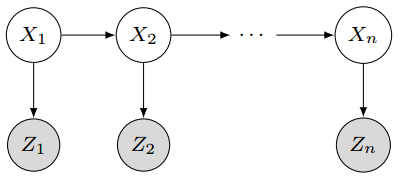

# Tracking as Inference

## 1. Inference system

- **Hidden State** ($$X$$): True parameters we care about
- **Measurement** ($$Y$$): Noisy observation of underlying state

At each time step $$t$$, state changes (from $$X_{t-1}$$ to $$X_t$$), and we get a new observation $$Y_t$$

**Our goal**: recover most likely state $$X_t$$ given:

- All observation seen so far
- Knowledge about dynamics of state transitions

## 2. Steps of Tracking

### 2.1 Prediction

What is the next state of the object given past measurements?
$$
P(X_t | Y_0 = y_0, ..., Y_{t-1} = y_{t-1})
$$

### 2.2 Correction

Compute an updated estimate of the state from prediction and measurements
$$
P(X_t | Y_0 = y_0, ..., Y_{t-1} = y_{t-1}, Y_t = y_t)
$$

### 2.3 Tracking

The process of propagating this posterior distribution of state given measurements across time.

## 3. Simplifying Assumptions

### 3.1 **Only the immediate past matters**: (dynamics model)

$$
P(X_t | X_0, ..., X_{t-1}) = P(X_t | X_{t-1})
$$

### 3.2 Measurements depend only on the current state: (observation model)

$$
P(Y_t | X_0, Y_0, ..., X_{t-1}, Y_{t-1}, X_t) = P(Y_t | X_t)
$$

This is a **Hidden Markov Model (HMM)**

